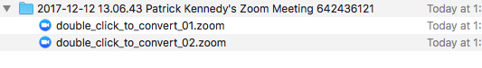
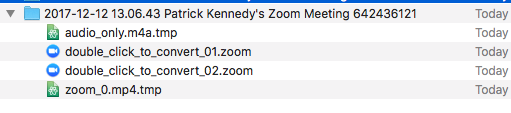
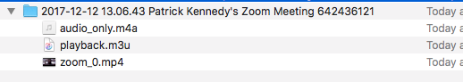

# fits_n_starts
some code I've been messing around with

# Local Zoom Recording File Sequence

1. While recording:  

2. While transcoding:  

3. When finished:  

### macOS default recording directory
- `/Users/<USERNAME>/Documents/Zoom/YYYY-MM-DD HH.MM.SS <USERNAME>'s Zoom Meeting <9_Digit_Number>`
- i.e. `~/Documents/Zoom/YYYY-MM-DD HH.MM.SS <USERNAME>'s Zoom Meeting <9_Digit_Number>`
- e.g. `/Users/mixelpix/Documents/Zoom/2017-12-12 11.23.03 Patrick Kennedy's Zoom Meeting 901264977`
#### QUESTIONS
1. is the 9 digit number just a random number, or does it have some significance? I think it is random. Why is it needed?

### Zoom recording flow
1. `.zoom` wile recording (Zoom waits until meeting is ended to start converting)
2. `.tmp` while converting
3. `.mp4` when done (.zoom and .tmp are deleted, when conversion is finished, the folder containing the converted files is loaded up in the Finder)
#### QUESTIONS
I think it might be enough for a daemon to keep an eye on any subfolder within the ~/Documents/Zoom directory. Specifically, looking for `.mp4` files.

1. How to handle _when_ to upload `.mp4` files? Condition met when "Date Modified" or file "Size" has not changed for a given duration of time?
2. Should the daemon register `.mp4` files which have already been uploaded?
3. Should the daemon delete `.mp4` files which have already been uploaded? Wait a week?
4. Can the daemon ask for confirmation before uploading? Send a system notification when it sees something to send?
5. How and when to enter data for YouTube, e.g. video title and description?

# Things to try
### Daemon/Cron job
- https://www.npmjs.com/package/daemon
  - THIS appears to be a NO GO.
- https://www.npmjs.com/package/cron
- https://www.npmjs.com/package/node-cron

### Upload to YouTube
- https://github.com/tokland/youtube-upload
- https://www.npmjs.com/package/youtube-uploader

### OAuth
- https://developers.google.com/youtube/v3/guides/authentication

### OS notifier
- https://www.npmjs.com/package/node-notifier
